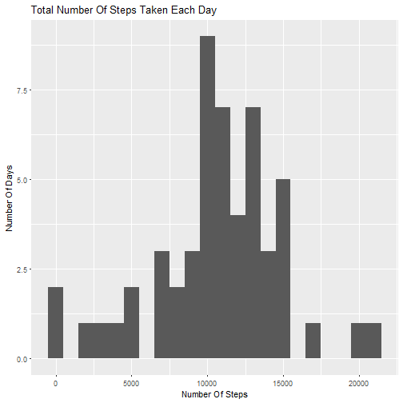
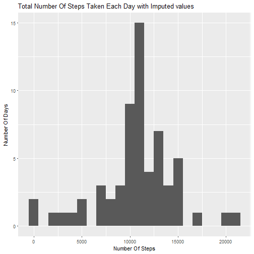
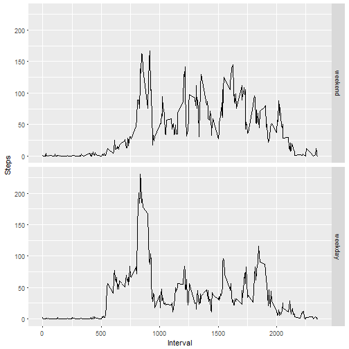

# Loading and preprocessing the data


```r
library(ggplot2)
library(knitr)
```

###1.Load the data 
Here I am  assuming that the csv file needed is in the working directory 

```r
df<-read.table("activity.csv", header = TRUE, sep = ",", na.strings = "NA")

head(df)
```

```
##   steps       date interval
## 1    NA 2012-10-01        0
## 2    NA 2012-10-01        5
## 3    NA 2012-10-01       10
## 4    NA 2012-10-01       15
## 5    NA 2012-10-01       20
## 6    NA 2012-10-01       25
```

#What is mean total number of steps taken per day?

###1.Calculate the total number of steps taken per day


```r
stepsByDay <- with(df, tapply(steps, date,sum))
head(stepsByDay)
```

```
## 2012-10-01 2012-10-02 2012-10-03 2012-10-04 2012-10-05 2012-10-06 
##         NA        126      11352      12116      13294      15420
```

###2.Make a histogram of the total number of steps taken each day


```r
qplot(stepsByDay, binwidth=1000, xlab="Number Of Steps", 
      ylab= "Number Of Days", main = "Total Number Of Steps Taken Each Day")
```



###3.Calculate and report the mean and median of the total number of steps taken per day


####The Mean Steps taken is **1.0766189 &times; 10<sup>4</sup>**
####The Median is **10765**

#What is the average daily activity pattern?

###1.Make a time series plot (i.e. type = "l") of the 5-minute interval (x-axis) and the average number of steps taken, averaged across all days (y-axis)


```r
meansteps <- aggregate(steps ~ interval, df, mean)
plot(meansteps$interval,meansteps$steps, type = "l", xlab="Interval", ylab="Average Steps", main="Daily Activity Pattern")
```


###2.Which 5-minute interval, on average across all the days in the dataset, contains the maximum number of steps?


```r
 HighestInterval <- meansteps[which.max(meansteps$steps),1]
```
####The 5 Minutes Interval with maximum steps on average is **835**

#Imputing missing values

###1.Calculate and report the total number of missing values in the dataset (i.e. the total number of rows with NAs)


```r
Nas<- length(which(is.na(df$steps)))
```
####Number of missing values are **2304**

###2.Devise a strategy for filling in all of the missing values in the dataset
#### To solve this problem i'll use the mean for each interval calculaed in the steps above.

###3.Create a new dataset that is equal to the original dataset but with the missing data filled in


```r
df2 <- df
df2$steps<- ifelse( is.na(df$steps), meansteps$steps, df$steps)

head(df2)
```

```
##       steps       date interval
## 1 1.7169811 2012-10-01        0
## 2 0.3396226 2012-10-01        5
## 3 0.1320755 2012-10-01       10
## 4 0.1509434 2012-10-01       15
## 5 0.0754717 2012-10-01       20
## 6 2.0943396 2012-10-01       25
```

###4.Make a histogram of the total number of steps taken each day and Calculate and report the mean and median total number of steps taken per day. Do these values differ from the estimates from the first part of the assignment? What is the impact


```r
stepsByDay2 <-  with(df2, tapply(steps, date, FUN=sum, na.rm=TRUE))

qplot(stepsByDay2, binwidth=1000, xlab="Number Of Steps", 
     ylab= "Number Of Days", main = "Total Number Of Steps Taken Each Day with Imputed values")
```



```r
men2 <- mean(stepsByDay2, na.rm=TRUE)
med2 <- median(stepsByDay2, na.rm=TRUE)
```

####The New Mean Steps taken is **1.0766189 &times; 10<sup>4</sup>**

####The New Median is **1.0766189 &times; 10<sup>4</sup>**

#### There are not much diiference in the new mean and median calculated with imputed values. this is because the nas are removed in the earlier calculation


#Are there differences in activity patterns between weekdays and weekends?

###1.Create a new factor variable in the dataset with two levels - "weekday" and "weekend" indicating whether a given date is a weekday or weekend day.


```r
df2$date<-strptime(df2$date, "%Y-%m-%d")
weekend <- c("Saturday", "Sunday")

df2$days <- factor((weekdays(df2$date) %in% weekend), 
                   levels=c(TRUE, FALSE), labels=c('weekend', 'weekday'))
```

###2.Make a panel plot containing a time series plot (i.e. type = "l") of the 5-minute interval (x-axis) and the average number of steps taken, averaged across all weekday days or weekend days (y-axis). See the README file in the GitHub repository to see an example of what this plot should look like using simulated data.


```r
meanbydays <- aggregate(steps ~ interval + days, df2, mean)
ggplot(meanbydays, aes(interval, steps)) + geom_line() + facet_grid(days ~ .) +
    xlab("Interval") + ylab("Steps")
```


